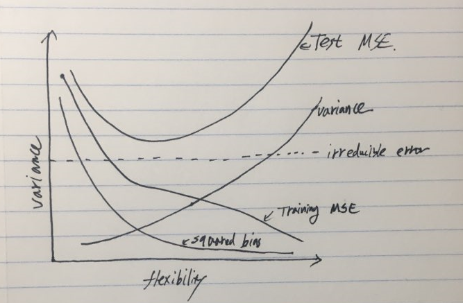

## 1. For each part, indicate whether we would generally expect the performance of a flexible statistical learning method to be better or worse than an inflexible method. Justify your answer.

  a.The sample size $n$ is extremely large, and the number of predictors $p$ is small.
  
  * I think a flexible method would generally perform better than an inflexible method in this situation. This is partly because a large number of sample size would help us to avoid overfitting. Additionally, we can better exploit the large sample size by using a more flexible method. 
  
  b.The number of predictors $p$ is extremely large, and the number of observations $n$ is small.
  
  * I think a flexible statistical method would not work very well in this case because there is a good chance that some outliers can distort the shape of a resulting function estimated by a given statistical learning method. (And substantially speaking, Lasso regression, which is one good example of inflexible learning methods, actually addresses the situation described here.)
  
  c.The relationship between the predictors and response is highly non-linear.
  
  * I think a flexible method should be preferred in this case because the more flexible a statistical learning method is the more complex shapes of resulting function it could be. 
  
  d.The variance of the error terms $\sigma^2 = Var(\epsilon)$ is extremely high.
  
  * I think a flexible model would do worse because it could take capture more errors to fit the model than an inflexible model.


## 2. Bias-variance decomposition



  * The **training MSE** monotonically decrease as model flexibility increases because the model will fit more closely to the observed data with more flexibility.

  * The **test MSE** declines until the model starts to overfit the training data but it will rise, making it U-shape as flexibility further increases.
  
  * The **irreducible error** (or the Bayes-error) stays constant regardless of the change of flexibility because it does not come from a model selection. It stems from the data.
  
  * The **squared bias** goes down as flexibility increases because the more flexible the model it is, the better it represents the actual problem we want to solve. 
  
  * The **variance** goes up as flexibility increases. This is because the more flexible a model is, it is more likely to produce different estimations with different sets of training data. In other words, a flexible model is less robust than a relatively inflexible model, which gives rise to a higher variance. 

  
## 3. Producing a graph

```{r warning = F, message = F, fig.width = 6, fig.height= 4}
library(ggplot2)
library(tidyverse)
theme_set(theme_minimal())

#simulate the data set of N = 200 with randome seeds
set.seed(1901121)
x1 <- runif(n = 200, min = -1, max = 1)
x2 <- runif(n = 200, min = -1, max = 1)

# calculate Y with errors
errors <- rnorm(n = 200, mean = 0, sd = sqrt(0.25))
y <- x1 + x1**2 + x2 + x2**2 + errors

#transform log odds to prob
prob_y <- exp(y) / (1 + exp(y))

#create grid for decision boundary
x_grid <- seq(-1 ,1, by=0.02)
y_grid <- seq(-1, 1, by=0.02)
grid <- expand.grid(x = x_grid, y = y_grid)
grid <- as.tibble(grid)
grid <- grid %>%
  mutate(class = ifelse(x + x**2 + y + y**2 > 0.5, "success", "failure"))

#preparing a graph
df <- cbind(x1, x2, y, prob_y)
df <- as.tibble(df)
df <- df %>% 
  mutate(class = ifelse(prob_y > 0.5, "success", "failure"))

#draw the graph
graph <- ggplot() + geom_point(aes(x = x1, y = x2, color = class), 
                               shape = 1, size = 2, data = df) +
  geom_point(data = grid, aes(x = x, y = y, color = class), size = 1, alpha = 0.3) + 
  ggtitle("The result of classification with 200 simulated data") 

graph
```
